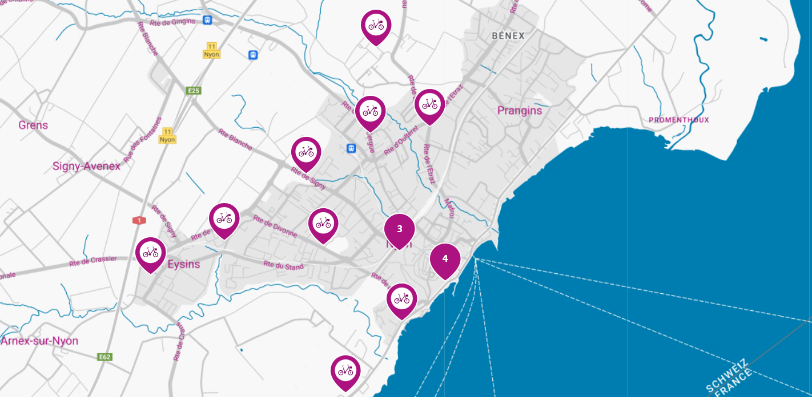

```{r data, include = FALSE}
library(tidyverse)
library(broom)
library(fpp3)
library(zoo)
library(timeDate)
library(patchwork)
```

```{r setup, include=FALSE}
knitr::opts_chunk$set(echo = TRUE)
```

# Introduction

This project focuses on estimating demand at each of the 13 bike-sharing stations in the city of Nyon, Switzerland. The stations are as follows:

This map shows how the stations are spread out across Nyon. Apart from the two bike stations around Nyon Gare, most stations are spread out.



# Exploratory Data Analysis and Data Wrangling / Cleaning

```{r data_load, include = FALSE}

load('Bikesharing_dataset.Rdata')

changins <- series[['Nyon, Changins']]
debarcadere <- series[['Nyon, Débarcadère']]
garesud <- series[['Nyon, Gare Sud']]
piscine <- series[['Nyon, Piscine du Cossy']]
hopital <- series[['Nyon, Hôpital']]
perdtemps <- series[['Nyon, Petit Perdtemps']]
hostel <- series[['Nyon, Hostel']]
savoie <- series[['Nyon, Place de Savoie']]
plage <- series[['Nyon, La Plage']]
colovray <- series[['Nyon, Stade de Colovray']]
triangle <- series[['Nyon, Triangle de l\'Etraz']]
gare_nord <- series[['Nyon, Gare Nord']]
chateau <- series[['Nyon, Château']]

total <- rbind(changins, debarcadere, garesud, piscine, hopital, perdtemps, hostel, savoie, plage, colovray, triangle, gare_nord, chateau)

```

## Data Wrangling

The dataset had several missing values. While most of the data was at intervals of 10 minutes, there were several cases where data was at half-hourly intervals. In order to deal with the missing data, graphs were created that showed how much the data varied across hours. The analysis revealed that the number of bikes and e-bikes at stations does not differ that much from hour to hour, there fore it is unlikely that it differs within 30 minute intervals either. The gaps were hence filled with the last previous available value. Capacity was also removed to save space as it is a constant value and does not affect the forecast. Dates were converted into R's POSIXct format for ease of use. `TotalBikes` was created as a sum of `Bike` and `E-Bike`. After this, the dataset was divided into training and test sets to test accuracy. Data prior to May 11th was used as the training set and the remaining two weeks data was used as a test set.

``` {r datawrangling1, include = FALSE}
total$date <- as.POSIXct(total$date)
total.ts <- as_tsibble(total, index = date, key = name, regular = TRUE)
total.ts <- total.ts %>% select(!Capacity)
total.ts <- total.ts %>% mutate(TotalBikes = Bike + `E-Bike`)
total.ts %>% scan_gaps()
total.ts <- total.ts %>% fill_gaps(.full = TRUE)
total.ts <- na.locf(total.ts)
total.ts %>% scan_gaps()
test.ts <- total.ts %>% filter(as.Date(date) >= as.Date("2022-05-11"))
total.ts <- total.ts %>% filter(as.Date(date) < as.Date("2022-05-11"))
```

```{r TotalBikesPlotAllDatesAllRegions, echo=FALSE, fig.cap= "Fig 1.1 - Variable demand across each station"}
total.ts %>%
  autoplot(TotalBikes, show.legend = FALSE) +
  facet_wrap(vars(name)) +
  ggtitle("Number of Bikes by Station") +
  ylab("Number of Bikes") +
  xlab("Date")
```

The plot above shows the number of bikes at each station in Nyon. There is no clear correlation between the graphs and their locations are far enough that the group decided against them. As each graph exhibits variable seasonality in terms of time of day and week. Further decomposition of seasonality to motivate this choice can be found in Fig 1.1 in the Appendix.

```{r TotalBikeDemandByTime, echo = FALSE, fig.cap="Fig 1.2 Combined Bike Demand"}
total.ts %>% 
  summarize(count = sum(TotalBikes)) %>% 
  autoplot() + 
  ggtitle("Bike Demand in Nyon", 
          subtitle = "Combined Bikes and E-Bikes Demand") + 
  xlab("Time") + 
  ylab("Count of Bikes")
```

Fig 1.2 shows that the total bike demand is erratic. There is a clear drop in the last week of March, possibly owing due to the snowy conditions in Western Switzerland.

`Bike` and `E-Bike` are to compared next:

``` {r bikeandebikecomparison, echo = FALSE, warning = FALSE, message = FALSE}

#plotting e-bikes and bikes together
p1 <- total.ts %>%
        group_by() %>%
        summarize(bikecount = sum(Bike), ebikecount = sum(`E-Bike`)) %>% 
        gather("id", "value", 2:3) %>% 
        ggplot(., aes(date, value)) +
        geom_line() +
        facet_wrap(~id)
        labs(title = "Comparison of Bike and E-Bike Demand", x = 'Date', y = 'Total Bikes')

#plotting correlation between Bike and E-BIke
p2 <- total.ts %>%
        group_by() %>%
        summarize(bikecount = sum(Bike), ebikecount = sum(`E-Bike`)) %>%
        ggplot() + 
        geom_jitter(aes(bikecount, ebikecount)) +
        geom_smooth(se = FALSE, method = 'lm', aes(bikecount, ebikecount)) +
        labs(title = "Correlation between Bike Demand and E-Bike Demand", x = "Bikes", y = "E-Bikes")

(p2) / (p1)

```

Intuitively, bike demand depends on a number of factors such as time of day, the day of the week and the weather. The dataset already contains information that can be used to create new features such as `timeofday`, `weekday` and `holidays`. Data regarding holidays was extracted from the commune's website.

``` {r featureenginerring, include = FALSE}

total.ts$weekday = as.factor(ifelse(isWeekday(total.ts$date), "Weekday", "Weekend"))
holidays <- c(as.Date("2022-04-15"),as.Date("2022-04-17"),as.Date("2022-04-18"),as.Date("2022-04-25"), as.Date("2022-05-01"))
total.ts$holiday <- as.factor(ifelse(as.Date(total.ts$date) %in% holidays, 1, 0))
```

The boxplots show how `TotalBikes` differs at each station depending on whether it's a weekend/weekday and whether the day in question is a public holiday. In this time frame, the most relevant public holidays were: Easter and Labour Day.

``` {r boxplotholidayweekend, echo = TRUE, fig.dim = c(15,10)}

b1 <- ggplot(total.ts) +
  geom_boxplot(aes(x = name, y = TotalBikes, color = weekday)) +
  coord_flip()

b2 <- ggplot(total.ts) +
  geom_boxplot(aes(x = name, y = TotalBikes, color = holiday)) +
  coord_flip() +
  labs(x = NULL)

(b1 / b2)
```

There doesn't seem to be much variation in the total number of bikes available when it comes to weekdays vs weekends. However, there is a clear difference between holidays and non-holidays. Areas like La Plage have no demand on holidays such as Easter Monday and the number of bikes available at the station is very high.

Next, we add the weather data and see if it has an impact on the available bikes at each station. Weather data was accessed using `WorldWeatherOnline` API. WWO provides a number of metrics such as temperature, precipitation, visibility among others. The assumption is that better weather leads to more bikes in demand.

```{r loadingweatherdata, include = FALSE}
weather <- read.csv("Data/weather_data.csv")

weather <- weather %>% select(-c('tempC', 'mintempC', 'sunHour', 'moon_illumination', 'moonrise', 'moonset', 'sunrise', 'sunset',
                     'DewPointC', 'pressure', 'FeelsLikeC', 'winddirDegree', 'location'))

total.ts$date_time <-  format(total.ts$date, format = '%F %H:00:00')

bikes <- merge(total.ts, weather, by = "date_time")
bikes.ts <- as_tsibble(bikes, index = date, key = name, regular = TRUE)
bikes.simplified <- bikes.ts %>% select(!c(Bike, `E-Bike`, date_time))
```

Let's look at that assumption using a temperature colored graph for one station `Nyon, Gare Nord`:

```{r tempgraph, echo = TRUE, fig.cap = "Correlation between temperature and number of bikes at station"}
bikes.simplified %>% filter(name == 'Nyon, Gare Nord') %>% ggplot() +
  geom_line(aes(x = date, y = TotalBikes, color = maxtempC)) +
  scale_color_gradient(low = "blue", high = "red") +
  labs(title = "Bike Count by Temperature", x = 'Date', y = 'Number of Bikes at Station')
```

We can see that there is some correlation between weather and the number of bikes. As the temperature is higher, there are fewer bikes available at a station, as the temperature is lower. There are more bikes available.